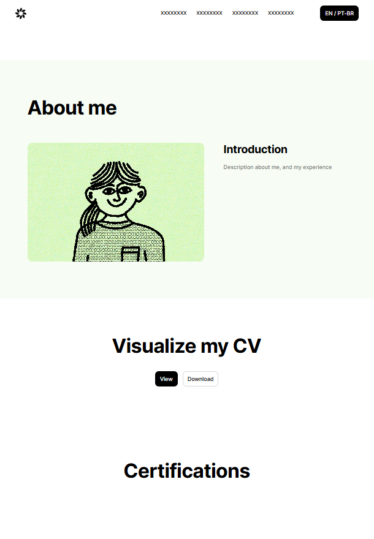
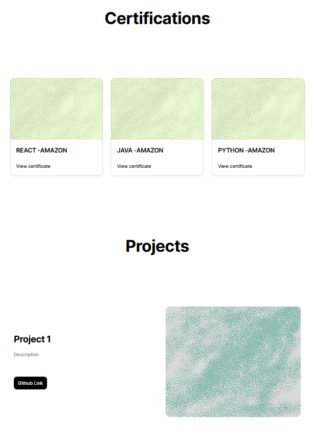
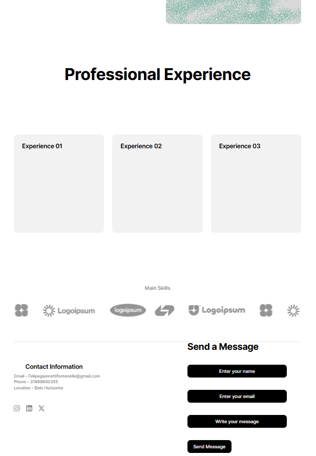

# 👨‍💻 Felipe Giannetti Fontenelle - Portfólio Pessoal

> Um portfólio web moderno e responsivo desenvolvido como projeto de disciplina de Engenharia de Software, apresentando projetos, experiências, certificações e informações de contato com suporte bilíngue (PT/EN).

Este projeto demonstra boas práticas em desenvolvimento web moderno, incluindo arquitetura de componentes React, design responsivo com Tailwind CSS, internacionalização (i18n), e integração com serviços externos como EmailJS para funcionalidades de contato.

---

## 🚧 Status do Projeto


---

## 📚 Índice

- [🔗 Links Úteis](#-links-úteis)
- [📝 Sobre o Projeto](#-sobre-o-projeto)
- [✨ Funcionalidades Principais](#-funcionalidades-principais)
- [🛠 Tecnologias Utilizadas](#-tecnologias-utilizadas)
- [🏗 Arquitetura](#-arquitetura)
- [🔧 Instalação e Execução](#-instalação-e-execução)
- [📂 Estrutura de Pastas](#-estrutura-de-pastas)
- [🎥 Demonstração](#-demonstração)
- [🧩 Wireframes](#-wireframes)
- [🔗 Documentações Utilizadas](#-documentações-utilizadas)
- [👥 Autores](#-autores)
- [🤝 Contribuição](#-contribuição)
- [🙏 Agradecimentos](#-agradecimentos)
- [📄 Licença](#-licença)

---

## 🔗 Links Úteis

🌐 **Demo Online:** [https://seu-portfolio-deploy.vercel.app](https://seu-portfolio-deploy.vercel.app)
> Acesse a aplicação em produção hospedada na Vercel

📧 **Contato:** [felipegiannettifontenelle@gmail.com](mailto:felipegiannettifontenelle@gmail.com)
> Entre em contato via e-mail para dúvidas ou oportunidades

---

## 📝 Sobre o Projeto

### 🎯 Propósito

Este projeto foi desenvolvido como trabalho prático da disciplina de **Laboraório de Desenvolvimento de Software** do curso de **Engenharia de Software** (4º período - PUC Minas), com o objetivo de criar um portfólio profissional moderno que mostre habilidades de desenvolvimento web, projetos realizados e experiências profissionais.

### 🎓 Contexto Acadêmico

- **Disciplina:** Projeto de Software
- **Professor Orientador:** Prof. Dr. João Paulo Aramuni
- **Instituição:** PUC Minas - Engenharia de Software
- **Período:** 4º Período
- **Semestre:** 2026/1

---

## ✨ Funcionalidades Principais

- 🌐 **Navegação Responsiva:** Menu adaptável para desktop e mobile com scroll suave
- 🇧🇷 🇬🇧 **Bilíngue (PT/EN):** Suporte completo para português e inglês com toggle de idioma
- 📄 **Visualizador de Currículo:** Modal pop-up para exibir e baixar curriculo em PDF
- 👤 **Seção Sobre Mim:** Apresentação profissional com cards informativos
- 🎓 **Certificações:** Grid minimalista com suporte para ~30+ certificações
- 📊 **Timeline de Projetos:** Apresentação visual de projetos em linha do tempo alternada
- 💼 **Experiências Profissionais:** Cards com detalhes de trabalho, internships e freelances
- 🛠 **Seção de Habilidades:** Showcase de tecnologias e competências principais
- 📧 **Formulário de Contato:** Integrado com EmailJS para envio de mensagens
- 📱 **Links de Contato Direto:** WhatsApp, Email, LinkedIn e GitHub
- 🎨 **Design Moderno:** Paleta de cores profissional 
- ⚡ **Performance Otimizada:** Vite para build rápido e HMR instantâneo
- 🔍 **SEO Friendly:** Estrutura semântica HTML adequada

---

## 🛠 Tecnologias Utilizadas

### 💻 Front-end
- **React** v18.2.0 - Biblioteca UI
- **Vite** v5.1.0 - Build tool e dev server
- **Tailwind CSS** v3.4.1 - Estilização utilitária
- **React Icons** v5.0.1 - Biblioteca de ícones
- **EmailJS Browser** v4.3.3 - Serviço de e-mail client-side
- **JavaScript ES6+** - Linguagem base

### ⚙️ Infraestrutura & DevOps
- **Node.js** LTS (v18+) - Runtime
- **npm** / **yarn** - Gerenciador de pacotes
- **Git** - Versionamento de código
- **GitHub** - Repositório e hosting
- **Vercel** - Deploy em produção (recomendado)

### 🧪 Desenvolvimento
- **ESLint** - Lintagem de código (opcional)
- **Prettier** - Formatação de código (opcional)
- **VS Code** - Editor recomendado

---

## 🏗 Arquitetura

### 📐 Visão Geral

O projeto segue uma arquitetura **componente-driven** típica de aplicações React modernas:

```
┌─────────────────────────────────────┐
│         App.jsx (Root)              │ ← Gerencia estado global (idioma, currículo)
│    └─ Language State (PT/EN)        │
└─────────────────────────────────────┘
            │
    ┌───────┼───────┬─────────┬──────────┐
    ↓       ↓       ↓         ↓          ↓
┌────────┐ ┌──────┐ ┌───────┐ ┌────────┐ ┌──────┐
│ Navbar │ │About │ │Certif.│ │Projects│ │Exper.│ → Contact
└────────┘ └──────┘ └───────┘ └────────┘ └──────┘
   │          │        │          │         │         │
   └──────────┴────────┴──────────┴─────────┴─────────┘
           Props Drilling (language, setShowCurriculo)
```

### 🧱 Componentes Principais

| Componente | Responsabilidade | Props |
|---|---|---|
| **Navbar** | Navegação, toggle idioma, botão CV | `language`, `setLanguage`, `setShowCurriculo` |
| **About** | Apresentação pessoal, modal de CV | `language`, `showCurriculo`, `setShowCurriculo` |
| **Certifications** | Grid de certificações | `language` |
| **Projects** | Timeline de projetos | `language` |
| **Experience** | Cards de experiências + skills | `language` |
| **Contact** | Formulário e links sociais | `language` |

### 🔄 Padrões de Design Adotados

- **Props Drilling:** Passagem de estado (idioma) entre componentes
- **Conditional Rendering:** `{language === 'en' ? ... : ...}` para conteúdo bilíngue
- **Component Composition:** Componentes reutilizáveis e modulares
- **Responsive Design:** Mobile-first com Tailwind breakpoints

---

## 🔧 Instalação e Execução

### 📋 Pré-requisitos

Antes de começar, certifique-se de ter instalado:

- **Node.js** versão LTS (v18.x ou superior) - [Download](https://nodejs.org/)
- **npm** (incluso com Node.js) ou **yarn**
- **Git** para clonar o repositório - [Download](https://git-scm.com/)

Verifique as versões instaladas:

```bash
node --version    # v18.x ou superior
npm --version     # 8.x ou superior
```

### 🔑 Variáveis de Ambiente

Crie um arquivo `.env.local` na raiz do projeto com as seguintes variáveis (opcional):

```env
# EmailJS (Configurar para funcionalidade de contato)
VITE_EMAILJS_SERVICE_ID=seu_service_id_aqui
VITE_EMAILJS_TEMPLATE_ID=seu_template_id_aqui
VITE_EMAILJS_PUBLIC_KEY=sua_public_key_aqui
```

> **Nota:** As variáveis de ambiente devem começar com `VITE_` para serem reconhecidas pelo Vite.

### 📦 Instalação de Dependências

1. **Clone o repositório:**

```bash
git clone https://github.com/seu-usuario/portifolio-lab-01.git
cd portifolio-lab-01
```

2. **Instale as dependências:**

```bash
npm install
# ou
yarn install
```

### ⚡ Como Executar a Aplicação

Execute o servidor de desenvolvimento:

```bash
npm run dev
# ou
yarn dev
```

A aplicação estará disponível em: **http://localhost:5173**

O Vite oferecerá HMR (Hot Module Replacement) instantâneo durante desenvolvimento.

### 🏗 Build para Produção

Para gerar a versão otimizada para produção:

```bash
npm run build
# ou
yarn build
```

Os arquivos compilados ficarão na pasta `/dist`.

Para visualizar o build localmente:

```bash
npm run preview
# ou
yarn preview
```

---

## 📂 Estrutura de Pastas

```
portifolio-lab-01/
├── .env.example              # 🧩 Exemplo de variáveis de ambiente
├── .env.local                # 🔒 Variáveis SENSÍVEIS (não versionado)
├── .gitignore                # 🧹 Arquivos ignorados pelo Git
├── README.md                 # 📘 Documentação principal
├── package.json              # 📦 Dependências e scripts
├── package-lock.json         # 🔒 Lock file das dependências
│
├── public/                   # 📁 Arquivos estáticos servidos diretamente
│   ├── curriculo.pdf         # 📄 CV em português
│   ├── curriculo-en.pdf      # 📄 CV em inglês
│   └── wireframe/            # 🧩 Imagens dos wireframes
│       ├── 1.png             # 🖼️ Wireframe 1
│       ├── 2.png             # 🖼️ Wireframe 2
│       └── 3.png             # 🖼️ Wireframe 3
│
├── src/                      # 📁 Código-fonte
│   ├── App.jsx               # 🎯 Componente raiz (gerencia estado global)
│   ├── main.jsx              # 🚀 Ponto de entrada
│   ├── index.css             # 🎨 Estilos globais + Tailwind directives
│   │
│   └── components/           # 🧱 Componentes reutilizáveis
│       ├── Navbar.jsx        # 🔝 Navegação principal
│       ├── About.jsx         # 👤 Seção Sobre Mim
│       ├── Certifications.jsx # 🎓 Certificações
│       ├── Projects.jsx      # 📊 Timeline de Projetos
│       ├── Experience.jsx    # 💼 Experiências Profissionais
│       └── Contact.jsx       # 📧 Formulário de Contato
│
├── vite.config.js            # ⚙️ Configuração do Vite
├── tailwind.config.js        # 🎨 Configuração do Tailwind
├── postcss.config.js         # 🛠 Configuração do PostCSS
└── index.html                # 📄 HTML raiz
```

### 📋 Descrição das Pastas

- **`/public`** - Arquivos estáticos (PDFs, imagens) servidos diretamente
- **`/src`** - Código-fonte React
- **`/src/components`** - Componentes reutilizáveis da aplicação

---

## 🎥 Demonstração

### 🌐 Aplicação Web

| Seção | Preview |
|---|---|
| **Navbar & Hero** | Navegação com toggle de idioma e botão CV |
| **Sobre Mim** | Cards com informações pessoais e modal de currículo |
| **Certificações** | Grid responsivo com ~30 certificações |
| **Projetos** | Timeline visual com cards de projetos |
| **Experiências** | Cards com experiências, skills e tecnologias |
| **Contato** | Formulário com links sociais (LinkedIn, GitHub, WhatsApp) |

---

## 🧩 Wireframes

Link Figma: https://www.figma.com/site/O56Td1mVCTmJ3IYauhLqmG/Wireframe-Sprint-01?node-id=0-1&t=r4tyA0axS9l3HVxz-1





---

## 🔗 Documentações Utilizadas

- 📖 [React Documentation](https://react.dev/) - Documentação oficial do React
- 📖 [Vite Documentation](https://vitejs.dev/) - Guia oficial do Vite
- 📖 [Tailwind CSS Documentation](https://tailwindcss.com/docs) - Referência Tailwind
- 📖 [React Icons](https://react-icons.github.io/react-icons/) - Biblioteca de ícones
- 📖 [EmailJS Documentation](https://www.emailjs.com/docs/) - Serviço de e-mail
- 📖 [Conventional Commits](https://www.conventionalcommits.org/) - Padrão de commits

---

## 👥 Autores

| Nome | GitHub | LinkedIn | Email |
|---|---|---|---|
| **Felipe Giannetti Fontenelle** | [@felipegiannetti](https://github.com/felipegiannetti) | [Felipe Giannetti Fontenelle](https://www.linkedin.com/in/felipe-giannetti-fontenelle-095501312/) | felipegiannettifontenelle@gmail.com |

---


### 📝 Padrão de Commits

Utilize Conventional Commits para manter o histórico limpo:

- `feat:` - Novas funcionalidades
- `fix:` - Correção de bugs
- `style:` - Alterações de estilo (CSS, formatação)
- `refactor:` - Refatoração de código
- `docs:` - Alterações na documentação
- `test:` - Testes

Exemplo:
```bash
git commit -m "feat: adiciona seção de certificações"
git commit -m "fix: corrige responsividade no mobile"
git commit -m "docs: atualiza README com instruções de deploy"
```

---


<div align="center">

**Desenvolvido por [Felipe Giannetti Fontenelle](https://github.com/felipegiannetti)**

📱 WhatsApp: [+55 31 999900355](https://wa.me/5531999900355)
📧 Email: [felipegiannettifontenelle@gmail.com](mailto:felipegiannettifontenelle@gmail.com)
🔗 LinkedIn: [felipe-giannetti-fontenelle](https://www.linkedin.com/in/felipe-giannetti-fontenelle-095501312/)

</div>
