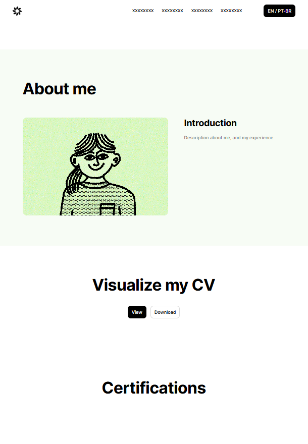
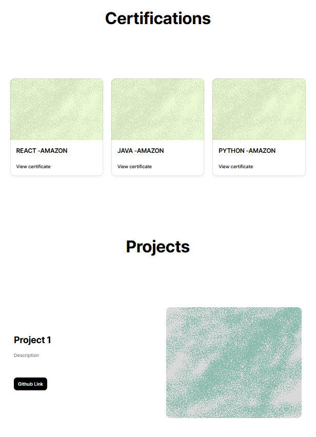
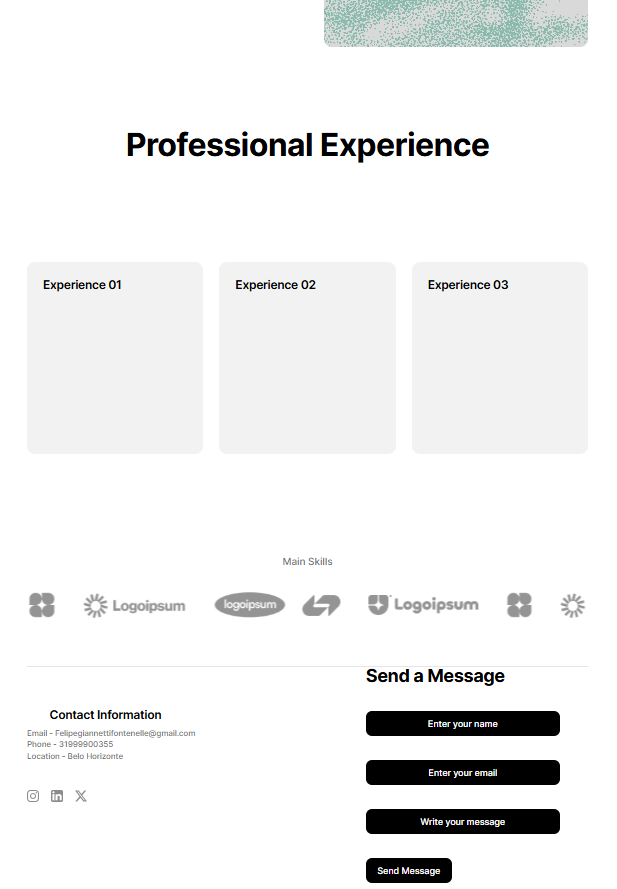

# 👨‍💻 Felipe Giannetti Fontenelle - Portfólio Pessoal

> Um portfólio web moderno e responsivo desenvolvido como projeto da disciplina de Laboratório de Desenvolvimento de Software, apresentando projetos, experiências, certificações e informações de contato com suporte bilíngue (PT/EN).

Este projeto demonstra boas práticas em desenvolvimento web moderno, incluindo arquitetura de componentes React, design responsivo com Tailwind CSS, internacionalização (i18n) e integração com serviços externos como EmailJS para funcionalidades de contato.

---

## 🚧 Status do Projeto


---

## 📚 Índice

- [🔗 Links Úteis](#-links-úteis)
- [📝 Sobre o Projeto](#-sobre-o-projeto)
- [✨ Funcionalidades Principais](#-funcionalidades-principais)
- [🛠 Tecnologias Utilizadas](#-tecnologias-utilizadas)
- [🏗 Arquitetura](#-arquitetura)
- [🔧 Instalação e Execução](#-instalação-e-execução)
- [📂 Estrutura de Pastas](#-estrutura-de-pastas)
- [🎥 Demonstração](#-demonstração)
- [🧩 Wireframes](#-wireframes)
- [🔗 Documentações Utilizadas](#-documentações-utilizadas)
- [👥 Autores](#-autores)
- [🤝 Contribuição](#-contribuição)
- [🙏 Agradecimentos](#-agradecimentos)
- [📄 Licença](#-licença)

---

## 🔗 Links Úteis


🌐 **Demo Online:** https://portfolio-felipe-giannetti-fontenelle.vercel.app/
> Acesse a aplicação publicada na Vercel

📧 **Contato:** [felipegiannettifontenelle@gmail.com](mailto:felipegiannettifontenelle@gmail.com)
> Entre em contato via e-mail para dúvidas ou oportunidades

🐙 **Repositório:** [github.com/felipegiannetti/portifolio-lab-01](https://github.com/felipegiannetti/portifolio-lab-01)

---

## 📝 Sobre o Projeto

### 🎯 Propósito

Este projeto foi desenvolvido como trabalho prático da disciplina de **Laboratório de Desenvolvimento de Software** do curso de **Engenharia de Software** (4º período - PUC Minas), com o objetivo de criar um portfólio profissional moderno que mostre habilidades de desenvolvimento web, projetos realizados e experiências profissionais.

### 🎓 Contexto Acadêmico

- **Disciplina:** Laboratório de Desenvolvimento de Software
- **Professor Orientador:** Prof. Dr. João Paulo Aramuni
- **Instituição:** PUC Minas - Engenharia de Software
- **Período:** 4º Período
- **Semestre:** 2026/1

---

## ✨ Funcionalidades Principais

- 🌗 **Tema claro/escuro:** alternância com preferência salva (respeita o tema do sistema)
- 🇧🇷 🇬🇧 **Bilíngue (PT/EN):** suporte completo aos dois idiomas, com preferência salva
- ⌨️ **Paleta de comandos (Ctrl/⌘ + K):** navegação rápida, abrir currículo, trocar tema/idioma, copiar e-mail
- 🧭 **Navegação inteligente:** barra fixa com scrollspy, barra de progresso de leitura e botão de voltar ao topo
- ✍️ **Hero interativo:** texto que alterna entre áreas de atuação (Software, Full Stack, Cibersegurança, Dados & IA)
- 🔢 **Estatísticas animadas** e cards com efeito *spotlight* que segue o cursor e *tilt* 3D
- 💼 **Experiência em abas:** Anglo American (SOC), FG Consultoria, PUC Minas e Clube Chalezinho, com cargos e conquistas detalhados
- 🚀 **Projetos com filtros:** por área (Web, IA & Dados, Cibersegurança, Robótica) e cards expansíveis
- 🛠 **Skills por categoria:** carrossel de tecnologias + filtros (Front-end, Back-end, Dados & DevOps, Cibersegurança, Práticas)
- 🎓 **41 certificações** com busca, filtros por categoria e ordenação por data (fonte: LinkedIn)
- 🏆 **Destaques:** prêmio de trabalho de destaque (PUC Minas), McKinsey.org Forward Program e carrossel de publicações do LinkedIn
- 📄 **Visualizador de currículo:** modal com PDF em PT/EN e download
- 📧 **Formulário de contato:** EmailJS (sem back-end) + links diretos (WhatsApp, e-mail, LinkedIn, GitHub)
- ♿ **Acessibilidade:** respeita `prefers-reduced-motion`, foco visível e navegação por teclado
- ⚡ **Performance:** Vite, sem bibliotecas de animação (IntersectionObserver + CSS)

---

## 🛠 Tecnologias Utilizadas

### 💻 Front-end

| Tecnologia | Versão | Uso |
|---|---|---|
| **React** | 18.2.0 | Biblioteca UI e gerenciamento de estado |
| **Vite** | 5.1.0 | Build tool, dev server e HMR |
| **Tailwind CSS** | 3.4.1 | Estilização utilitária e design responsivo |
| **React Icons** | 5.0.1 | Ícones (FontAwesome, SimpleIcons) |
| **@emailjs/browser** | 4.3.3 | Envio de e-mail client-side sem back-end |
| **JavaScript ES6+** | — | Linguagem base |

### 🎨 Estilo & Fontes

| Tecnologia | Uso |
|---|---|
| **Inter + Space Grotesk** | Fontes via Google Fonts |
| **Design tokens (CSS variables)** | Cores `canvas`, `surface`, `ink`, `muted`, `accent`, `accent2`, `accent3` com tema claro/escuro |
| **CSS Animations** | Keyframes para blobs de fundo, marquee, float e reveal on scroll |

### ⚙️ Ferramentas de Build

| Tecnologia | Versão | Uso |
|---|---|---|
| **@vitejs/plugin-react** | 4.2.1 | Suporte a JSX e Fast Refresh |
| **PostCSS** | 8.4.35 | Processamento de CSS |
| **autoprefixer** | 10.4.17 | Prefixos CSS para compatibilidade |
| **Node.js** | LTS (v18+) | Runtime de desenvolvimento |

### ☁️ Infraestrutura & DevOps

| Ferramenta | Uso |
|---|---|
| **Git** | Versionamento de código com Conventional Commits |
| **GitHub** | Hospedagem do repositório |
| **Vercel** | Plataforma recomendada para deploy (em breve) |

---

## 🏗 Arquitetura

### 📐 Visão Geral

O projeto segue uma arquitetura **componente-driven** típica de aplicações React modernas:

```
┌─────────────────────────────────────┐
│         App.jsx (Root)              │ ← Gerencia estado global (idioma, currículo)
│    └─ Language State (PT/EN)        │
└─────────────────────────────────────┘
            │
    ┌───────┼───────┬─────────┬──────────┐
    ↓       ↓       ↓         ↓          ↓
┌────────┐ ┌──────┐ ┌───────┐ ┌────────┐ ┌──────┐
│ Navbar │ │About │ │Certif.│ │Projects│ │Exper.│ → Contact
└────────┘ └──────┘ └───────┘ └────────┘ └──────┘
   │          │        │          │         │         │
   └──────────┴────────┴──────────┴─────────┴─────────┘
           Props Drilling (language, setShowCurriculo)
```

### 🧱 Componentes Principais

| Componente | Responsabilidade | Props |
|---|---|---|
| **Navbar** | Navegação com scrollspy, tema, idioma, CV e paleta de comandos | `language`, `theme`, `setLanguage`, `toggleTheme`, `setShowCurriculo`, `openPalette` |
| **Hero** | Apresentação com texto rotativo e foto | `language`, `setShowCurriculo` |
| **About** | Texto do LinkedIn, formação, idiomas e estatísticas animadas | `language` |
| **Experience** | Experiências em abas com cargos e conquistas | `language` |
| **Projects** | Grid com filtro por área e cards expansíveis | `language` |
| **Skills** | Carrossel de tecnologias + filtro por categoria | `language` |
| **Certifications** | Destaques + busca/filtros das 41 certificações | `language` |
| **Highlights** | Reconhecimentos e carrossel de posts do LinkedIn | `language` |
| **Contact** | Formulário EmailJS + links sociais | `language` |
| **CvModal / CommandPalette** | Modal do currículo e menu Ctrl/⌘ + K | — |

### 🔄 Padrões de Design Adotados

- **Props Drilling:** Passagem de estado (idioma) entre componentes
- **Conditional Rendering:** `{language === 'en' ? ... : ...}` para conteúdo bilíngue
- **Component Composition:** Componentes reutilizáveis e modulares
- **Responsive Design:** Mobile-first com Tailwind breakpoints (`md:`, `lg:`)
- **useRef para intervalos:** Evita stale closures em animações com `setInterval`

---

## 🔧 Instalação e Execução

### 📋 Pré-requisitos

Antes de começar, certifique-se de ter instalado:

- **Node.js** versão LTS (v18.x ou superior) — [Download](https://nodejs.org/)
- **npm** (incluso com Node.js) ou **yarn**
- **Git** — [Download](https://git-scm.com/)

Verifique as versões:

```bash
node --version    # v18.x ou superior
npm --version     # 8.x ou superior
```

---

### 1. Clone o repositório

```bash
git clone https://github.com/felipegiannetti/portifolio-lab-01.git
cd portifolio-lab-01
```

### 2. Instale as dependências

```bash
npm install
```

### 3. Configure as variáveis de ambiente

Copie o arquivo de exemplo e preencha com suas chaves do EmailJS:

```bash
cp .env.example .env
```

Edite o `.env`:

```env
VITE_EMAILJS_SERVICE_ID=seu_service_id_aqui
VITE_EMAILJS_TEMPLATE_ID=seu_template_id_aqui
VITE_EMAILJS_PUBLIC_KEY=sua_public_key_aqui
```

> **Como obter as chaves:** Acesse [emailjs.com](https://www.emailjs.com/), crie um serviço de e-mail e um template. As chaves ficam em **Account → API Keys**.  
> **Nota:** Sem essas variáveis, o site funciona normalmente — apenas o formulário de contato não enviará e-mails.

### 4. Execute em modo de desenvolvimento

```bash
npm run dev
```

A aplicação estará disponível em **http://localhost:5173** com HMR (Hot Module Replacement) ativo.

---

### 🏗 Build para Produção

```bash
npm run build
```

Os arquivos otimizados serão gerados na pasta `/dist`.

Para pré-visualizar o build localmente antes de publicar:

```bash
npm run preview
```

---

### 🚀 Deploy na Vercel (recomendado)

1. Faça fork/push do repositório para o GitHub
2. Acesse [vercel.com](https://vercel.com/) e importe o repositório
3. Configure as variáveis de ambiente (`VITE_EMAILJS_*`) nas Settings do projeto
4. Clique em **Deploy** — a Vercel detecta Vite automaticamente

---

### 🛠 Scripts Disponíveis

| Script | Comando | Descrição |
|---|---|---|
| Desenvolvimento | `npm run dev` | Inicia o servidor local com HMR |
| Build | `npm run build` | Gera build otimizado em `/dist` |
| Preview | `npm run preview` | Serve o build localmente para testes |

---

## 📂 Estrutura de Pastas

```
portifolio-lab-01/
├── .env                      # 🔒 Variáveis de ambiente (não versionado)
├── .env.example              # 🧩 Exemplo de variáveis de ambiente
├── .gitignore                # 🧹 Arquivos ignorados pelo Git
├── README.md                 # 📘 Documentação principal
├── index.html                # 📄 HTML raiz (fonte Share Tech Mono, favicon)
├── package.json              # 📦 Dependências e scripts
├── package-lock.json         # 🔒 Lock file das dependências
├── vite.config.js            # ⚙️ Configuração do Vite + plugin React
├── tailwind.config.js        # 🎨 Configuração do Tailwind (cores customizadas)
└── postcss.config.js         # 🛠 Configuração do PostCSS + autoprefixer
│
├── public/                   # 📁 Arquivos estáticos servidos diretamente
│   ├── curriculo.pdf         # 📄 CV em português
│   ├── curriculo-en.pdf      # 📄 CV em inglês
│   ├── favicon.svg           # 🖼️ Ícone da aplicação
│   ├── foto-perfil.jpg       # 🖼️ Foto de perfil
│   ├── projects/             # 📁 Imagens dos projetos
│   │   ├── drone.png         # 🖼️ DTI Drone Delivery System
│   │   ├── n8n.png           # 🖼️ n8n Random Number Connector
│   │   └── robo.png          # 🖼️ Robot Battle
│   └── wireframe/            # 🧩 Imagens dos wireframes
│       ├── 1.png             # 🖼️ Wireframe 1
│       ├── 2.png             # 🖼️ Wireframe 2
│       └── 3.png             # 🖼️ Wireframe 3
│
└── src/                      # 📁 Código-fonte
    ├── App.jsx               # 🎯 Componente raiz (gerencia estado global)
    ├── main.jsx              # 🚀 Ponto de entrada
    ├── index.css             # 🎨 Tokens de tema, Tailwind e animações CSS
    ├── hooks.js              # 🪝 useInView, useCountUp, useRotatingText, storage
    ├── data/profile.js       # 🗂 Contatos e itens de navegação
    │
    └── components/           # 🧱 Componentes reutilizáveis
        ├── Navbar.jsx        # 🔝 Navegação, scrollspy, tema e idioma
        ├── Hero.jsx          # 🏠 Apresentação com texto rotativo
        ├── About.jsx         # 👤 Sobre mim, formação, idiomas, estatísticas
        ├── Experience.jsx    # 💼 Experiências em abas
        ├── Projects.jsx      # 🚀 Projetos com filtros
        ├── Skills.jsx        # 🛠 Skills por categoria
        ├── Certifications.jsx # 🎓 41 certificações com busca e filtros
        ├── Highlights.jsx    # 🏆 Reconhecimentos + posts do LinkedIn
        ├── Contact.jsx       # 📧 Formulário EmailJS + links sociais
        ├── CvModal.jsx       # 📄 Modal do currículo
        ├── CommandPalette.jsx # ⌨️ Menu Ctrl/⌘ + K
        └── ui.jsx            # 🧩 Reveal, SectionHeader, Tilt, formatMonth
```

---

## 🎥 Demonstração

### 🌐 Aplicação Web

| Seção | Descrição |
|---|---|
| **Navbar** | Navegação fixa com scrollspy, tema claro/escuro, toggle PT/EN, botão CV e paleta de comandos |
| **Hero / Sobre** | Apresentação com texto rotativo, foto, formação, idiomas e estatísticas animadas |
| **Certificações** | 41 certificações (Skillsoft, Cybrary, IBM, Amazon, SpecterOps, Claroty, entre outras) com busca e filtros |
| **Projetos** | Grid filtrável por área, com imagens, descrição, tecnologias e link GitHub |
| **Experiências / Skills** | Experiências em abas + skills por categoria |
| **Contato** | Formulário integrado com EmailJS + links diretos (WhatsApp, Email, LinkedIn, GitHub) |

---

## 🧩 Wireframes

Link Figma: https://www.figma.com/site/O56Td1mVCTmJ3IYauhLqmG/Wireframe-Sprint-01?node-id=0-1&t=r4tyA0axS9l3HVxz-1





---

## 🔗 Documentações Utilizadas

- 📖 [React Documentation](https://react.dev/) - Documentação oficial do React
- 📖 [Vite Documentation](https://vitejs.dev/) - Guia oficial do Vite
- 📖 [Tailwind CSS Documentation](https://tailwindcss.com/docs) - Referência Tailwind
- 📖 [React Icons](https://react-icons.github.io/react-icons/) - Biblioteca de ícones
- 📖 [EmailJS Documentation](https://www.emailjs.com/docs/) - Serviço de e-mail client-side
- 📖 [Google Fonts – Share Tech Mono](https://fonts.google.com/specimen/Share+Tech+Mono) - Fonte utilizada
- 📖 [Conventional Commits](https://www.conventionalcommits.org/) - Padrão de commits
- 📖 [Vercel Documentation](https://vercel.com/docs) - Guia de deploy

---

## 👥 Autores

| Nome | GitHub | LinkedIn | Email |
|---|---|---|---|
| **Felipe Giannetti Fontenelle** | [@felipegiannetti](https://github.com/felipegiannetti) | [Felipe Giannetti Fontenelle](https://www.linkedin.com/in/felipe-giannetti-fontenelle-095501312/) | felipegiannettifontenelle@gmail.com |

---

## 🤝 Contribuição

Contribuições são bem-vindas! Para contribuir com o projeto:

1. **Fork** o repositório
2. Crie uma **branch** para sua feature: `git checkout -b feat/minha-feature`
3. **Commit** suas alterações seguindo o padrão Conventional Commits: `git commit -m "feat: adiciona minha feature"`
4. **Push** para a branch: `git push origin feat/minha-feature`
5. Abra um **Pull Request** descrevendo as mudanças

> Para bugs, abra uma [issue](https://github.com/felipegiannetti/portifolio-lab-01/issues) descrevendo o problema encontrado.

### 📝 Padrão de Commits

| Prefixo | Uso |
|---|---|
| `feat:` | Nova funcionalidade |
| `fix:` | Correção de bug |
| `style:` | Alterações de estilo (CSS, formatação) |
| `refactor:` | Refatoração sem mudança de comportamento |
| `docs:` | Alterações na documentação |
| `chore:` | Tarefas de manutenção (deps, configs) |

Exemplos:
```bash
git commit -m "feat: adiciona seção de certificações"
git commit -m "fix: corrige responsividade no mobile"
git commit -m "docs: atualiza README com instruções de deploy"
```

---

## 🙏 Agradecimentos

- **Prof. Dr. João Paulo Aramuni** — orientação e suporte durante a disciplina de Laboratório de Desenvolvimento de Software
- **PUC Minas** — infraestrutura e ambiente de aprendizado
- Comunidade **React** e **Tailwind CSS** — pela documentação rica e ecossistema open-source
- **Vercel** — pela plataforma de deploy gratuita e de fácil configuração
- **EmailJS** — pela solução de envio de e-mail client-side sem necessidade de back-end

---

## 📄 Licença

Este projeto está licenciado sob a licença **MIT**. Consulte o arquivo [LICENSE](LICENSE) para mais detalhes.

```
MIT License

Copyright (c) 2026 Felipe Giannetti Fontenelle

Permission is hereby granted, free of charge, to any person obtaining a copy
of this software and associated documentation files (the "Software"), to deal
in the Software without restriction, including without limitation the rights
to use, copy, modify, merge, publish, distribute, sublicense, and/or sell
copies of the Software, and to permit persons to whom the Software is
furnished to do so, subject to the following conditions:

The above copyright notice and this permission notice shall be included in all
copies or substantial portions of the Software.
```

---

<div align="center">

**Desenvolvido por [Felipe Giannetti Fontenelle](https://github.com/felipegiannetti)**

📱 WhatsApp: [+55 31 999900355](https://wa.me/5531999900355)
📧 Email: [felipegiannettifontenelle@gmail.com](mailto:felipegiannettifontenelle@gmail.com)
🔗 LinkedIn: [felipe-giannetti-fontenelle](https://www.linkedin.com/in/felipe-giannetti-fontenelle-095501312/)

</div>
